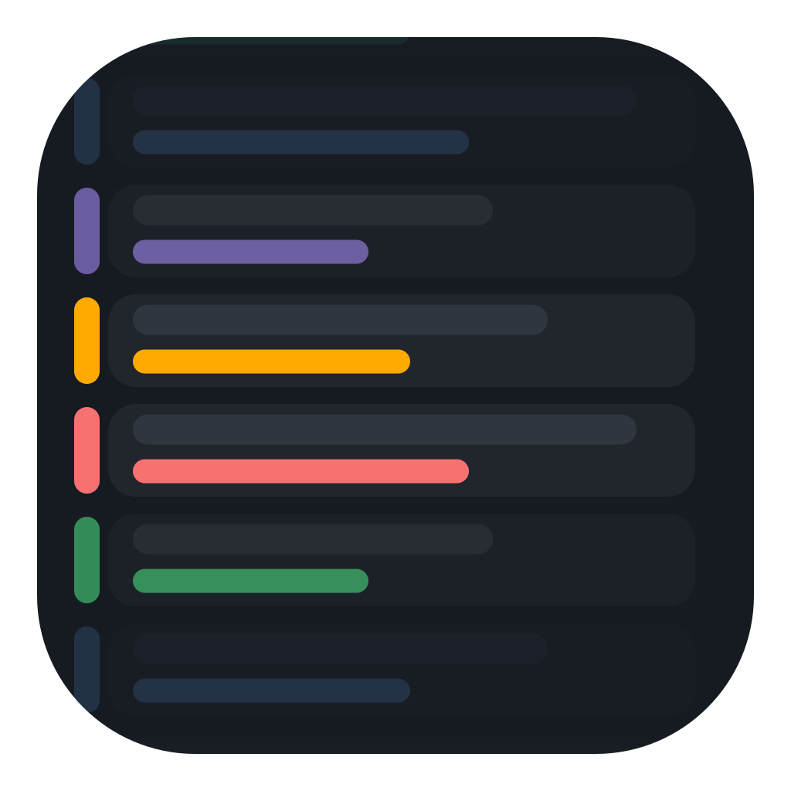
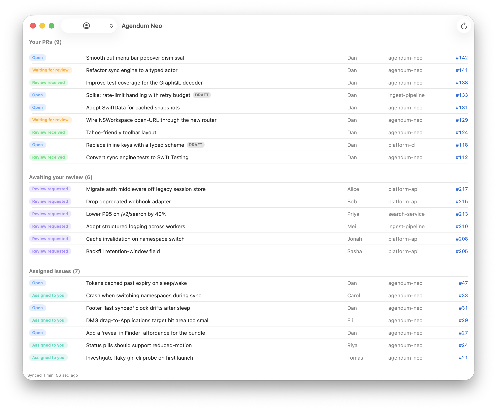

<h1>
  <a href="https://github.com/danseely/agendum-neo/releases/latest"></a>
  Agendum Neo
</h1>

---

A small native macOS app that surfaces your GitHub inbox:

- Open PRs you authored, with their current review state
- Open PRs where your review has been requested
- Open issues assigned to you

Items are grouped per section and scoped to the GitHub namespace (your user or one of your orgs) you pick from the toolbar. State syncs every 5 minutes.

Authentication piggybacks on the local [`gh` CLI](https://cli.github.com/) — there's no separate login. The app shells out to `gh auth token` to fetch the active token without disturbing `gh`'s active account.



## Requirements

- macOS 26 (Tahoe)
- Xcode 26
- [`gh`](https://cli.github.com/) ≥ 2.40 authenticated to at least one account with `repo` and `read:org` scopes

## Build & run

The Xcode project is generated from `project.yml` via [XcodeGen](https://github.com/yonaskolb/XcodeGen).

```sh
brew install xcodegen
xcodegen generate
open AgendumNeo.xcodeproj
```

Or build from the command line:

```sh
xcodebuild -project AgendumNeo.xcodeproj -scheme AgendumNeo -configuration Debug \
  -destination 'platform=macOS' build
```

## Project layout

```
AgendumNeo/
  AgendumNeoApp.swift     # @main, WindowGroup + MenuBarExtra scenes
  AppModel.swift          # @MainActor @Observable app state
  SyncEngine.swift        # 5-minute poll loop
  GitHub/                 # gh CLI shell-out + GraphQL client + models
  Views/                  # SwiftUI views
  Assets.xcassets/
AgendumNeoTests/          # Swift Testing unit tests
project.yml               # XcodeGen project definition
```

## Distribution

GitHub Actions runs build + tests on every push.

To cut a release, trigger the **Release** workflow manually with a tag (e.g. `v0.1.0`); it builds the Release configuration, packages the app into a DMG, and attaches the DMG to a new GitHub release.
