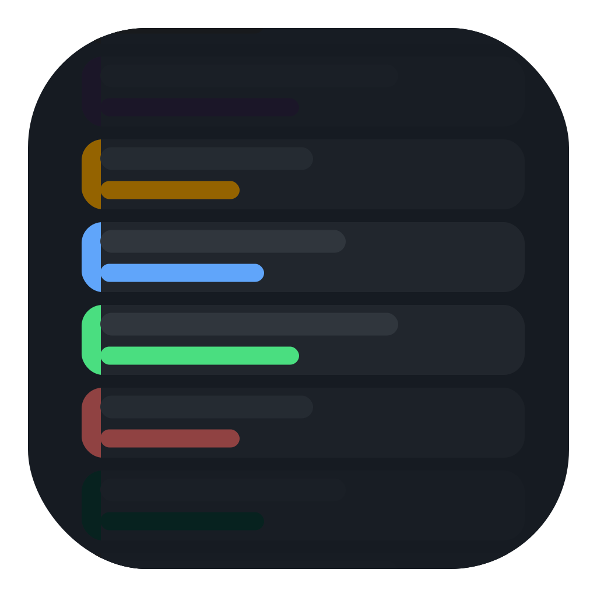

# App icon drafts

Every iteration explored while designing the v0.5.7 icon, in rough chronological
order. Scroll top to bottom to follow the process: start from the recolored
original, work through row count, edge fade, focus placement, geometry, and
finally the color arrangement that shipped.

These are the raw SVG sources (no PNGs committed). The shipped icon and the full
design writeup live one level up in [`../README.md`](../README.md). Regenerate a
PNG from any draft with:

```sh
rsvg-convert -w 1024 -h 1024 NAME.svg -o /tmp/NAME.png
```

> Note: GitHub renders these SVGs inline below. macOS additionally applies its
> own squircle mask and drop shadow at display time, so the Dock rendering is
> rounder than the square-cornered art shown here.

---

## 1. Starting point

The prior shipping icon's 3-row inbox, recolored to the exact in-app status
pill palette. Everything that follows is a variation on this.

<table>
<tr><td align="center"><br><b>A_recolor3</b><br>Original 3-row layout, exact palette</td></tr>
</table>

## 2. Row count

How many rows read best at icon scale.

<table>
<tr>
<td align="center"><br><b>B_rows5</b><br>Five rows</td>
<td align="center"><br><b>C_rows7</b><br>Seven rows</td>
</tr>
</table>

## 3. Edge fade

Keep three bright rows, then let the extra rows fade out toward the top and
bottom edges so the grid bleeds rather than stops hard.

<table>
<tr>
<td align="center"><br><b>D_fade7</b><br>Seven rows, fading toward both edges</td>
<td align="center"><br><b>E_fade5</b><br>Five rows, gentler fade</td>
</tr>
</table>

## 4. Focus placement

Where the bright, in-focus rows sit relative to center.

<table>
<tr>
<td align="center"><br><b>E1_center2</b><br>Two rows straddling center</td>
<td align="center"><br><b>E2_high</b><br>Focus shifted up</td>
<td align="center"><br><b>E3_low</b><br>Focus shifted down</td>
<td align="center"><br><b>E4_asym3</b><br>Asymmetric 3-row focus</td>
</tr>
</table>

## 5. Line-length tuning

Adjusting the horizontal bar lengths and right margin.

<table>
<tr>
<td align="center"><br><b>F1_longer</b><br>Longer bars</td>
<td align="center"><br><b>F2_tighter</b><br>Tighter right margin</td>
</tr>
</table>

## 6. Geometry: bars vs. cards

Whether each row is a plain colored bar or a full row card with a colored left
cap.

<table>
<tr>
<td align="center"><br><b>G1_origbars</b><br>Original bar geometry on the E1 layout (no row cards)</td>
<td align="center"><br><b>H1_cards</b><br>Row cards added back (6 rows)</td>
</tr>
</table>

## 7. Eight rows

One extra faded row top and bottom on top of the card geometry — this row count
carried through to the final.

<table>
<tr><td align="center"><br><b>I1_8rows</b><br>Eight rows, extra faded row at each edge</td></tr>
</table>

## 8. Square caps (rejected)

Square-right colored caps with a darken-toward-black fade instead of a fade to
the background. Rejected — the fade-to-black read as muddy.

<table>
<tr>
<td align="center"><br><b>J1_caps</b><br>Square-right caps + darken-to-black fade</td>
<td align="center"><br><b>J2_caps</b><br>Variant of the same</td>
</tr>
</table>

## 9. Cap padding

A gap between the card edge and the colored left cap.

<table>
<tr><td align="center"><br><b>K1_pad</b><br>Padding between card edge and colored cap</td></tr>
</table>

## 10. Line lengthening

Final tuning of the horizontal line lengths.

<table>
<tr>
<td align="center"><br><b>L1_longer</b><br>Lines lengthened</td>
<td align="center"><br><b>L2_longer10</b><br>Lengthened further</td>
</tr>
</table>

## 11. Color arrangements — the shipped family

With the layout settled, the last decision was which status color goes on which
row. High-chroma colors sit at the dimmed top/bottom edges so the fade reads
cleanly. **`C3_warm-hero` shipped.**

<table>
<tr>
<td align="center"><br><b>C1_vibrant-edges</b><br>Most saturated colors pushed to the edges</td>
<td align="center"><br><b>C2_spectrum</b><br>Full spectrum top to bottom</td>
<td align="center"><br><b>C3_warm-hero ✅</b><br>Warm pair (Waiting + Changes requested) at center — shipped</td>
</tr>
<tr>
<td align="center"><br><b>C4_cool-hero</b><br>Cool pair at center</td>
<td align="center"><br><b>C5_grey-at-center</b><br>Neutral grey at center</td>
<td></td>
</tr>
</table>
