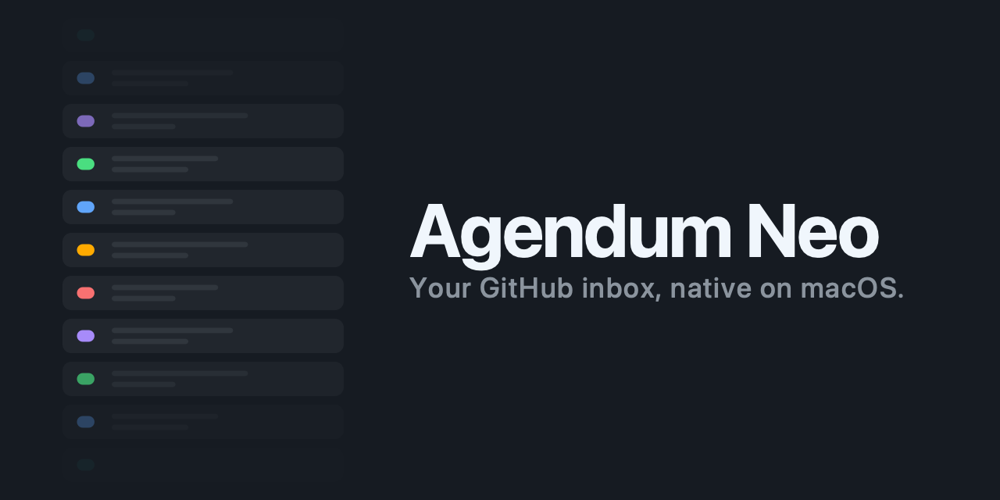
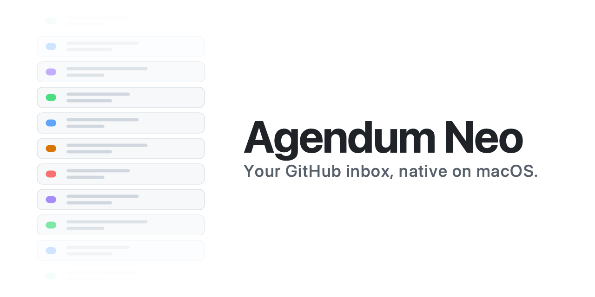

# Social preview

1280×640 OG images used when the repo URL is shared on Slack, Twitter, iMessage, etc.

## Variants

### Dark

Uploaded as the GitHub repo's social preview.

### Light

Kept for a future Pages site / light-mode contexts.

## Updating the social preview

GitHub doesn't expose the social preview upload via the REST or GraphQL APIs — it's UI-only. To replace it:

1. Open https://github.com/danseely/agendum-neo/settings.
2. Scroll to **Social preview**.
3. Click **Edit** → **Upload an image…** and pick `design/social-preview/icon-wordmark-dark.png`.
